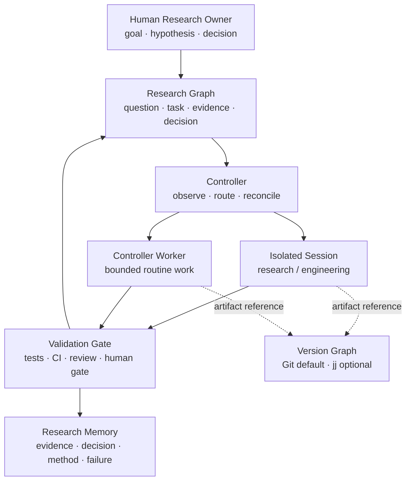

# Research OS Template

A domain-neutral operating template for AI-assisted research teams.

Research OS separates four concerns:

1. **Intent** — a human research owner defines goals, hypotheses, and decision criteria.
2. **Control** — a controller observes the task graph, evaluates policy, and selects the next action.
3. **Execution** — isolated sessions or bounded controller workers produce artifacts.
4. **Memory** — validated evidence, decisions, methods, and failures become reusable knowledge.

The template is designed for biomedical research, quantitative trading, sports probability research, and other evidence-driven domains.

## Hermes entry point

Hermes or another controller should start with [`HERMES.md`](HERMES.md), then load the machine-readable bootstrap contract in [`kernel/controller.yaml`](kernel/controller.yaml).

The entry point defines:

- the exact read order;
- the required first status report;
- the observe–evaluate–route–execute–validate loop;
- authority and escalation boundaries;
- the one-task/one-branch/one-worktree protocol;
- executor input and output contracts;
- recovery without hidden chat history.

## Operating model



The research graph is the source of truth for **why and what happens next**. Git or jj records **how files changed**. They are linked through artifact references but are not interchangeable.

## Repository map

```text
kernel/
  controller.yaml                Machine-readable controller bootstrap
  system.yaml                    Governance and authority boundaries
  schemas/                       Project, graph, task, and memory contracts
  workflows/state-machine.yaml   Shared lifecycle and transitions
  policies/                      Routing, validation, and memory promotion
  profiles/agent-profiles.yaml   Runtime-neutral execution profiles
  adapters/version-control.yaml  Git default and optional jj mapping
template/                        Copyable project starter
examples/
  pa-research/                   Complete pilot loop
  fmt-research/                  Biomedical domain instance
  beijing-lot-research/          Sports probability domain instance
docs/                            Architecture and pilot guidance
scripts/validate.rb              Dependency-free structural validation
```

## Quick start

```bash
git clone https://github.com/algotradinglife/research-os-template.git
cd research-os-template
make validate
```

To start a project, copy `template/`, then:

1. Complete `project.yaml`.
2. Define the initial nodes and edges in `graph.yaml`.
3. Create one task file per executable node.
4. Let the controller choose an executor mode from policy.
5. Require artifacts and validation before state transitions.
6. Promote only accepted outputs into memory.

For an existing domain repository, place project state under `.research/` instead of creating another repository:

```text
existing-domain-repo/
  .research/
    project.yaml
    graph.yaml
    tasks/
    memory/
```

Use one `research/<task-id>-<slug>` branch and one worktree for each isolated experiment.

The copied `project.yaml` points Hermes to this repository's controller contract. Replace `ref: main` with a release tag or commit before using the configuration in a stable production workflow.

See [Pilot guide](docs/pilot-guide.md) for a complete manual-first rollout.

## Core invariants

- Human owners retain final authority over hypotheses and consequential conclusions.
- The controller may route and reconcile work but may not silently change intent or acceptance criteria.
- Executor output is unverified until a validation gate passes.
- Research completion and engineering completion are separate.
- Negative and inconclusive results are valid research outcomes.
- Chat history is an interface, not the system of record.
- Sensitive data is referenced by controlled pointers and hashes, not committed by default.

## Validation

```bash
make validate  # YAML, state, routing, graph, and controller contracts
make e2e       # deterministic minimal controller loop
make test      # both suites
```

The minimal E2E uses local stub executor, validator, and human-decision fixtures. It verifies:

- high-uncertainty research routing;
- every persisted state transition;
- the human decision gate;
- graph/task consistency;
- audit generation;
- memory creation for an inconclusive result.

The E2E runner is a protocol reference, not a production Hermes runtime. It performs no network calls and launches no real agent.

## Status

`v0.1` is intentionally a manual-first template. Validate it with real projects before building a persistent controller or packaging it as a skill.

## License

MIT
